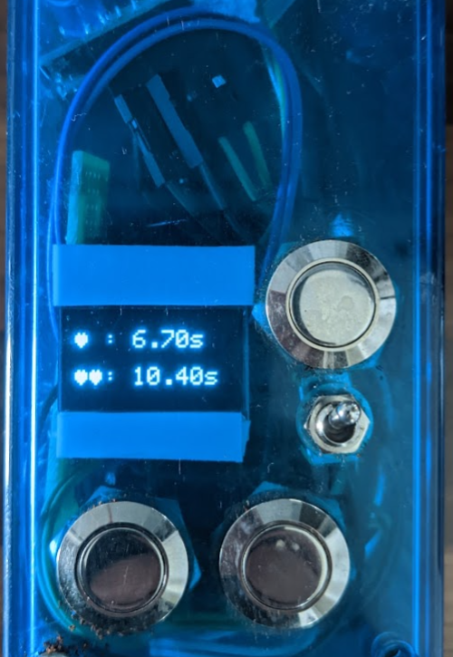
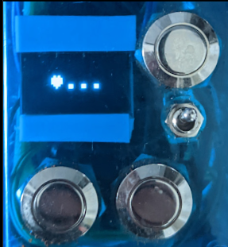
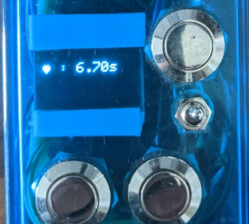

# Adjustable Coffee Grinder Timer on ESP8266
Upgrade your standard lo-fi coffee grinder with an adjustable timer for recreatable coffee quantities for better :coffee:.

An ESP8266 is controlling a relais to power the coffee grinder for a programmed amount of time for either a single or a double portion of coffee. Times are programmable and stored in the EEPROM memory of the ESP so the device can safely be turned off without losing the precious coffee setup.

Ugly real-world implementation:

## How does it work?
The ESP controls a relais that has been inserted into the power connection of the grinder. The display shows the currently setup grinding times for single or double portions. Pressing the single or double button will close the relais for the specified amount of time:

Pressing the third ("setup") button, will enter the setup mode for the single-grinding time. Use the single/double buttons to increase or decrease the time. 

Pressing the setup button again will enter the setup mode for the double-grinding time, where values can be adjusted the same way.
Pressing the setup button a third time stores the values and returns to the start sceen. 

The relais is closed by default, so when the ESP is switched off, the grinder can be used normally. Only when the ESP is on, the relais will be opened and only closed for the specified amount of time. 

## Hardware
- an ESP8266 (this uses a Lolin D1 Mini)
- 128x64 SSD1306 OLED screen (I2C)
- 3 Hardware Buttons
  1. Start Single-Portion Grinding
  2. Start Double-Portion Grinding
  3. Enter Setup Mode
- A relais to switch the 230V/110V line which can be controlled by GPO from the ESP
- a power switch

**:warning: AC grid power is dangerous. :warning:**
### Pinning (Lolin D1 Mini)
- Relais on D4
  - connect the power lines to the "Normally Closed" connection of the relais. When switched on, the ESP will set the relais pin to "HIGH" opening the relay. When grinding, the ESP will set the pin to "LOW" which will then close the relay for the specified amount of time
- Single Grinding button: D5
- Double Grinding button: D6
- Setup button: D7
- OLED Display
  - VCC: 3.3V
  - GND: GND
  - SCK/SLC: D1
  - SDA: D2

## Software
Download the files or clone the repository, open the *.ino file in Arduino and flash on the ESP.

